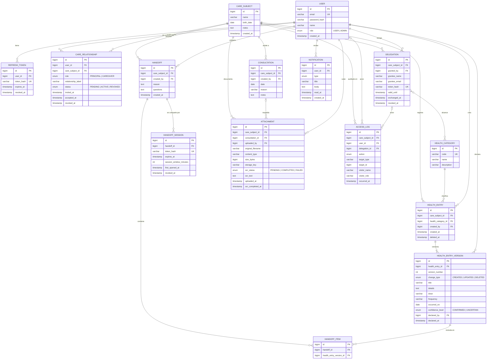

# Yuyay — Registro de salud compartido entre cuidadores

**Curso:** CS2031 · Desarrollo Basado en Plataformas · Universidad de Ingeniería y Tecnología (UTEC)
**Sección:** Laboratorio 11 · Grupo 3

**Integrantes**

| Integrante | Código |
| --- | --- |
| Caceres Sanchez, Matias Andres | 202510370 |
| Huapaya Núñez, Luis Felipe Augusto | 202220394 |
| Paredes Rodriguez, Nayra Kamila | 202510441 |
| Puicon Arapa, Valentina Yamile | 202510090 |
| Uceda Tang, Jocelyn Avril | 202510545 |

---

## Índice

1. [Introducción](#1-introducción)
2. [Identificación del problema o necesidad](#2-identificación-del-problema-o-necesidad)
3. [Descripción de la solución](#3-descripción-de-la-solución)
4. [Modelo de entidades](#4-modelo-de-entidades)
5. [Manejo de errores](#5-manejo-de-errores)
6. [Medidas de seguridad implementadas](#6-medidas-de-seguridad-implementadas)
7. [Eventos y asincronía](#7-eventos-y-asincronía)
8. [GitHub y gestión del proyecto](#8-github-y-gestión-del-proyecto)
9. [Ejecución local y despliegue](#9-ejecución-local-y-despliegue)
10. [Conclusión](#10-conclusión)
11. [Apéndices](#11-apéndices)

---

## 1. Introducción

### Contexto

Cuando varios familiares se turnan para cuidar a una persona con una condición persistente —un adulto mayor con medicación crónica, un menor con asma— la información queda repartida entre recetas de papel, el registro interno de cada clínica y la memoria del cuidador principal. Quien acompaña al paciente suele ser el que menos sabe: no puede responder qué toma ni qué cambió. La consulta se resuelve con información incompleta y nadie queda como responsable de lo declarado.

### Objetivos del proyecto

1. Mantener la información de salud compartida entre todos los cuidadores, con trazabilidad de quién declaró cada dato y cuándo.
2. Generar un resumen de traspaso que el acompañante muestre al médico en segundos, sin que el médico instale ni registre nada.
3. Delegar acceso temporal y limitado a terceros sin cuenta, como una enfermera contratada por una semana.
4. Garantizar que ningún endpoint exponga información fuera del alcance del rol o de la delegación vigente, filtrando a nivel de consulta.

---

## 2. Identificación del problema o necesidad

### Descripción del problema

La información clínica de una persona dependiente vive fragmentada y sin dueño: los sistemas de historia clínica no se comparten entre establecimientos y están pensados para el personal de salud, no para la familia que administra el día a día. El cuidador que acompaña responde de memoria e introduce errores en datos sensibles como dosis y alergias.

### Justificación

El costo es directo: prescripciones duplicadas, interacciones no detectadas y exámenes repetidos. Yuyay no pretende ser una historia clínica ni reemplazar el criterio médico: es un **registro declarativo**. No interpreta información ni sugiere dosis, y no garantiza que un dato sea verdadero; garantiza **quién lo declaró, cuándo y si alguien lo modificó**. Por eso cada dato lleva un nivel de confianza explícito (`CONFIRMED` o `UNCERTAIN`): registrar una duda es más honesto que forzar una certeza inexistente.

---

## 3. Descripción de la solución

### Funcionalidades implementadas

| Funcionalidad | Cómo resuelve el problema |
| --- | --- |
| **Cuentas y autenticación** | Registro y login con contraseñas cifradas; sesiones sin estado mediante JWT y refresh token rotatorio. |
| **Personas a cargo y vínculos de cuidado** | Un usuario registra a la persona que cuida e invita por correo a otros cuidadores. La invitación se acepta explícitamente; el vínculo tiene rol (`PRINCIPAL` o `CAREGIVER`), etiqueta de parentesco y vigencia, y puede revocarse. |
| **Registros de salud versionados** | Alergias, condiciones, medicación, vacunas y episodios. Editar nunca sobrescribe: crea una versión nueva e inmutable con autor y fecha, de modo que el historial de lo declarado se conserva completo. |
| **Consultas médicas** | Cada visita queda registrada con fecha y motivo, y sirve como punto de corte para revisar qué se registró después. |
| **Resumen de traspaso** | El cuidador que sabe arma una pantalla única con el motivo de la cita, las preguntas que quiere hacer y las versiones exactas de los datos que eligió mostrar. |
| **Enlace temporal del resumen** | Se comparte por un enlace que funciona sin cuenta, con fecha tope y ventana de minutos desde la primera apertura. Quien lo abre declara su nombre y rol, y queda registrado. |
| **Delegaciones** | Acceso temporal para alguien sin cuenta, limitado a categorías concretas y con vencimiento. El enlace se canjea una sola vez por un token de sesión con permisos restringidos. |
| **Notificaciones y correo** | Todos los cuidadores se enteran de los cambios; la bienvenida al registrarse, las invitaciones y las delegaciones llegan por correo con plantillas HTML. |
| **Bitácora de accesos** | Registro inmutable de quién vio o modificó qué y cuándo, incluidos los accesos anónimos por enlace. |
| **Adjuntos con OCR** | El cuidador sube la foto de una receta o un resultado de laboratorio; el archivo se guarda en almacenamiento externo y el texto se extrae de forma asíncrona. La extracción nunca crea un registro por sí sola: propone el texto y el cuidador decide. |
| **Administración** | Rol global `ADMIN` con endpoints propios para gestionar usuarios y consultar estadísticas del sistema. |

### Tecnologías utilizadas

Java 17 y **Spring Boot 4.1.1** (Web MVC, Data JPA con Hibernate 7, Security 7, Bean Validation), **PostgreSQL 16**, **MapStruct**, **Lombok**, **JJWT**, **Thymeleaf** para plantillas de correo y **Resend** como servicio de envío. Los adjuntos se almacenan en **AWS S3** y su texto se extrae con **AWS Textract**. El entorno local usa **Docker Compose**, la integración continua **GitHub Actions** y el despliegue **AWS (EC2 + RDS)**. Las pruebas usan JUnit 5, MockMvc y H2 en memoria.

### Arquitectura

El proyecto se organiza **por funcionalidad** (`auth`, `user`, `care`, `health`, `consultation`, `attachment`, `notification`, `audit`, `admin`), y dentro de cada una respeta las capas **Controller → Service → Repository**: los controladores reciben y devuelven DTOs validados, los servicios concentran reglas de negocio, autorización y transacciones, y los repositorios extienden `JpaRepository`. Las dependencias se inyectan por constructor y ninguna entidad JPA se expone en una respuesta HTTP.

---

## 4. Modelo de entidades



### Descripción de las entidades principales

**User** es la cuenta con la que alguien inicia sesión: hash de contraseña y rol global (`USER` o `ADMIN`); **RefreshToken** guarda el hash de cada refresh para rotarlo y revocarlo. **CareSubject** es la persona cuidada, que puede no tener cuenta propia, y **CareRelationship** es la entidad puente entre ambas: una relación muchos a muchos con datos propios (rol, parentesco, estado `PENDING`/`ACTIVE`/`REVOKED` y marcas de tiempo), razón por la cual es entidad y no un `@ManyToMany` simple. Solo el estado `ACTIVE` otorga acceso.

**HealthCategory** es el catálogo de tipos de dato (`ALLERGY`, `CONDITION`, `MEDICATION`, `IMMUNIZATION`, `EPISODE`). **HealthEntry** es solo la cabecera —persona, categoría, autor— y no contiene el dato clínico: ese contenido vive en **HealthEntryVersion**, inmutable, donde cada edición inserta una versión nueva con número correlativo, tipo de cambio, nivel de confianza y autor. Esa separación cumple la promesa del producto: reconstruir qué se declaró en cada momento y quién lo hizo.

**Consultation** registra una visita médica. **Handoff** es el resumen de una cita y **HandoffItem** lo vincula con las **versiones** elegidas, no con la cabecera, de modo que queda congelado aunque el dato cambie; **HandoffSession** es el enlace temporal para compartirlo. **Delegation** otorga acceso a alguien sin cuenta y se relaciona con `HealthCategory` por un `@ManyToMany` real (tabla `delegation_categories`), porque el alcance es una lista sin atributos propios. **Attachment** guarda la referencia al archivo subido —su clave en el almacenamiento, tipo, tamaño y el estado de la extracción de texto— asociado a la persona y, opcionalmente, a una consulta. **Notification** y **AccessLog** cierran el modelo: avisos por usuario y bitácora inmutable con tres actores posibles.

Las relaciones son `FetchType.LAZY` para no cargar historiales completos en cada consulta, y el `cascade` se decidió caso por caso: `Handoff` es dueño de sus items y sesiones y `CareSubject` de sus relaciones y consultas, pero **no** hay cascade hacia `HealthEntry` ni `AccessLog`, porque el historial y la auditoría no deben desaparecer como efecto colateral. Los borrados de salud son lógicos (`deleted_at`).

---

## 5. Manejo de errores

Toda excepción de negocio hereda de `YuyayException`, que lleva asociado su `HttpStatus`. Existen 20 personalizadas, 13 transversales y 7 propias de cada módulo (`CareSubjectNotFoundException`, `AttachmentNotFoundException`, etc.): `ResourceNotFoundException`, `DuplicateEmailException`, `InvalidCredentialsException`, `InvalidTokenException`, `ForbiddenCareSubjectAccessException`, `DuplicateCareRelationshipException`, `InvalidCareRelationshipException`, `InvalidHealthEntryException`, `InvalidHandoffException`, `HandoffSessionExpiredException`, `InvalidDelegationException`, `DelegationExpiredException` e `InvalidOperationException`.

Un único `@RestControllerAdvice` las traduce, junto con las de Spring (`MethodArgumentNotValidException`, `HttpMessageNotReadableException`, `DataIntegrityViolationException`, `AccessDeniedException`, `NoResourceFoundException`), al formato `ErrorResponseDTO` con `timestamp`, `status`, `error`, `message`, `path` y, en validaciones, los campos inválidos. Los errores del filtro de seguridad se escriben igual desde `JwtAuthenticationEntryPoint` y `JwtAccessDeniedHandler`, así el cliente nunca recibe una página HTML.

Centralizarlo evita que cada controlador repita `try/catch`, garantiza que el mismo fallo responda siempre igual y, sobre todo, impide filtrar detalles internos: los errores no controlados responden 500 genérico y el detalle queda en el log. Los códigos usados son 200, 201, 204, 400, 401, 403, 404, 409, 410 y 500.

---

## 6. Medidas de seguridad implementadas

### Seguridad de los datos

Las contraseñas se almacenan con **BCrypt** (factor 12) y nunca aparecen en una respuesta, porque los DTOs de salida no incluyen ese campo. La autenticación es **sin estado**: el login entrega un *access token* JWT de 60 minutos y un *refresh token* opaco de 7 días del que solo se guarda su **SHA-256**; cada uso lo rota y revoca el anterior, así un token filtrado sirve una sola vez. Los tokens de enlaces de resumen y de delegación reciben igual tratamiento: se generan con `SecureRandom`, se entregan una única vez y en la base queda solo su hash. Todos los secretos vienen de variables de entorno.

### Autorización en dos niveles

La decisión central es que **el rol global no determina el acceso a un recurso**. El JWT solo indica si quien llama es `USER`, `ADMIN` o `DELEGATE`; que pueda ver a una persona lo decide su `CareRelationship` activa, y que un delegado vea cierta categoría, su `Delegation` vigente. Esa verificación vive en `AuthorizationService`, invocado en cada método de servicio que toca datos de una persona; los endpoints de administración usan además `@PreAuthorize("hasRole('ADMIN')")`.

El filtrado ocurre **a nivel de consulta**, no del DTO: los listados no usan `findAll()`, sino JPQL con join a las relaciones activas del usuario, y el del delegado filtra por categorías permitidas en el propio `WHERE`. Un tercero sin vínculo recibe lista vacía, y por id recibe 403. Revocar una relación o delegación corta el acceso de inmediato, aunque el token siga vigente.

### Prevención de vulnerabilidades comunes

**Inyección SQL:** no se construye SQL por concatenación; todo el acceso pasa por Spring Data JPA con *query methods* derivados o JPQL con parámetros nombrados, que se traducen a sentencias preparadas.

**XSS:** la API devuelve solo JSON serializado por Jackson, que escapa el contenido; no se renderiza HTML con datos del usuario. Las plantillas de correo usan Thymeleaf, que escapa variables por defecto. La validación de entrada (`@Size`, `@Email`, `@Pattern`) limita además el contenido aceptado.

**CSRF:** la protección está deshabilitada de forma deliberada y segura: al ser una API sin estado sin cookies de sesión, la credencial viaja en la cabecera `Authorization`, que el navegador no adjunta solo en peticiones de terceros. **CORS** se restringe a los orígenes de `CORS_ALLOWED_ORIGINS`.

**Enumeración de usuarios:** el login responde igual ante correo inexistente y contraseña incorrecta, y los enlaces públicos responden 404 sin revelar si el token existió.

---

## 7. Eventos y asincronía

El sistema publica seis eventos de dominio, todos definidos como `record` inmutables que transportan únicamente identificadores:

| Evento | Se publica en | Listener | Efecto |
| --- | --- | --- | --- |
| `HealthEntryChangedEvent` | `HealthEntryService` al crear, editar o eliminar | `NotificationListener` | Crea una notificación para cada cuidador activo distinto del autor y le envía un correo |
| `UserRegisteredEvent` | `AuthService.register` | `EmailListener` | Envía el correo de bienvenida |
| `CaregiverInvitedEvent` | `CareRelationshipService.invite` | `EmailListener` | Envía el correo de invitación |
| `DelegationCreatedEvent` | `DelegationService.create` | `EmailListener` | Envía el enlace de acceso temporal al delegado |
| `AttachmentUploadedEvent` | `AttachmentService.upload` | `AttachmentListener` | Extrae el texto del archivo y actualiza su estado |
| `AccessRecordedEvent` | `HealthEntryService` (crear, ver, editar, borrar), apertura de un enlace, canje de delegación y lecturas del delegado | `AccessLogListener` | Inserta la entrada en la bitácora |

Los listeners se anotan con `@TransactionalEventListener(phase = AFTER_COMMIT)`, `@Async` y `@Transactional(propagation = REQUIRES_NEW)`, sobre un `ThreadPoolTaskExecutor` dedicado en `AsyncConfig`.

La asincronía no es decorativa: enviar un correo por un servicio externo puede tardar o fallar, y **no debe bloquear ni revertir** la operación del cuidador; quien registra un cambio de dosis recibe su 200 de inmediato y el correo sale después. `AFTER_COMMIT` garantiza que el listener solo corra si la transacción original terminó bien, evitando notificar cambios deshechos, y `REQUIRES_NEW` es necesario porque, al ejecutarse tras el commit y en otro hilo, necesita su propia transacción para escribir. Cada listener captura sus excepciones sin relanzarlas, así una caída del proveedor de correo nunca afecta a la API.

---

## 8. GitHub y gestión del proyecto

El trabajo se organizó en **GitHub Projects** con un tablero por estados e *issues* etiquetados (`feature`, `fix`, `test`, `docs`, `infra`) agrupados en *milestones* por fecha de entrega, asignados según el módulo responsable: seguridad y delegaciones, dominio de cuidado, salud y consultas, eventos y traspaso, e infraestructura.

El flujo de ramas es GitFlow simplificado: `main` protegida —requiere pull request, revisión aprobada y build verde— y una rama por funcionalidad (`feature/...`, `fix/...`, `docs/...`). Cada pull request usa una plantilla con lista de verificación (DTOs, autorización, excepción adecuada, pruebas, ausencia de secretos) y lo revisa otro integrante.

**GitHub Actions** corre la integración continua en cada push y pull request: compila y ejecuta la suite completa con `./mvnw verify` sobre H2, sin necesidad de base de datos externa. Un segundo workflow construye la imagen Docker y la despliega en AWS al integrar a `main`.

---

## 9. Ejecución local y despliegue

```bash
cp .env.example .env
docker compose up -d
./mvnw spring-boot:run
```

La API queda en `http://localhost:8080` y su estado en `/actuator/health`. Las pruebas (`./mvnw test`) usan H2 y no requieren Docker.

**Variables de entorno:** `DB_URL`, `DB_USERNAME`, `DB_PASSWORD`, `JWT_SECRET`, `JWT_ACCESS_EXPIRATION_MINUTES`, `JWT_REFRESH_EXPIRATION_DAYS`, `APP_BASE_URL`, `CORS_ALLOWED_ORIGINS`, `RESEND_API_KEY`, `MAIL_FROM`, `ADMIN_EMAIL`, `ADMIN_PASSWORD`, `ADMIN_NAME`.

**Documentación de la API:** `postman_collection.json` (raíz) contiene 106 peticiones en 15 carpetas, con ejemplos de respuesta, variables automáticas y casos de error para cada código HTTP; los entornos están en `postman/`. La especificación **OpenAPI** se genera automáticamente y se explora en `/swagger-ui.html`, con autenticación JWT desde el propio navegador.

**Despliegue:** la API está publicada en **http://34.193.16.240:8080** (estado en `/actuator/health`, documentación en `/swagger-ui.html`). Backend en **EC2** con Docker y base de datos en **RDS PostgreSQL**, accesible solo desde el grupo de seguridad de la instancia. Cada push a `main` ejecuta las pruebas, publica la imagen en GHCR, la despliega por SSH y verifica `/actuator/health`.

---

## 10. Conclusión

### Logros

Se implementó un backend completo que cubre el ciclo de uso del producto: registrar personas a cargo, coordinar cuidadores, mantener un historial versionado y auditable, preparar el resumen para la consulta, compartirlo con quien no tiene cuenta y delegar accesos acotados. Son 15 entidades JPA, 43 DTOs, 56 endpoints, 20 excepciones personalizadas y 6 eventos con procesamiento asíncrono, cubiertos por pruebas de integración que validan tanto el éxito como la autorización denegada.

### Aprendizajes clave

El aprendizaje central fue distinguir **autenticación** de **autorización contextual**: la intuición inicial era modelar "cuidador de Pedro" como un rol del token, y el diseño correcto resultó el opuesto —el token dice quién eres y la base de datos a qué tienes acceso en cada llamada—. El segundo fue el manejo de transacciones con eventos: entender por qué un listener asíncrono debe correr tras el commit y abrir su propia transacción evitó errores difíciles de diagnosticar. El tercero: el versionado inmutable resultó más simple y más fiel al problema que actualizar registros en su lugar.

### Trabajo futuro

Quedan planteadas dos extensiones de producto: notas de voz con transcripción al salir de la consulta y notificaciones push a la aplicación móvil. Sobre los adjuntos ya implementados, el siguiente paso es convertir el texto extraído en una sugerencia estructurada que el cuidador acepte con un toque. En lo técnico, migrar el esquema a Flyway y paginar todos los listados.

---

## 11. Apéndices

### Licencia

Este proyecto se distribuye bajo la **Licencia MIT**. El texto completo está en el archivo [`LICENSE`](LICENSE).

### Referencias

- Spring Boot Reference Documentation — https://docs.spring.io/spring-boot/index.html
- Spring Security Reference — https://docs.spring.io/spring-security/reference/index.html
- Spring Data JPA Reference — https://docs.spring.io/spring-data/jpa/reference/index.html
- Jakarta Bean Validation Specification — https://beanvalidation.org/
- JSON Web Token (RFC 7519) — https://datatracker.ietf.org/doc/html/rfc7519
- OWASP Top Ten — https://owasp.org/www-project-top-ten/
- MapStruct Reference Guide — https://mapstruct.org/documentation/stable/reference/html/
- Resend API Documentation — https://resend.com/docs
- Amazon EC2 y Amazon RDS User Guides — https://docs.aws.amazon.com/
